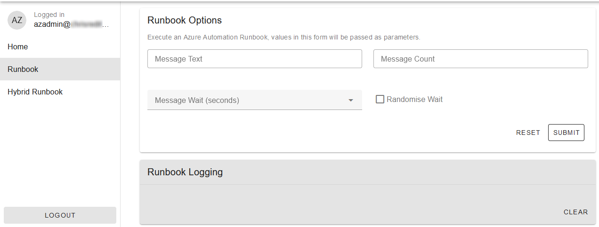

# Azure Automation GUI

A Web App front end for Azure Automation Runbooks. Use this project as a starting point for developing custom interfaces to trigger automation tasks. Based on the [Azure Static Web Apps](https://learn.microsoft.com/en-us/azure/static-web-apps/overview) (SWA) Free or Standard plans.



## Resource Deployment

Steps to create the example application, deploy either the Free or Standard plan. The Free plan uses an App Registration and Managed Function, the Standard plan uses Managed Identities and a standalone Function App.

1. Fork this repository in Github. A fork can be made private with the "Leave fork network" option and then setting the visibility to private.
2. Create a Resource Group in Azure as a target for the ARM template deployment. These steps use a group named `automation-gui-example`.

### Standard Plan Resource Deployment

1. Click the deploy to Azure button to start a Custom Deployment in Azure. The Resource Group created previously should be the target of the deployment.

    [](https://portal.azure.com/#create/Microsoft.Template/uri/https%3A%2F%2Fraw.githubusercontent.com%2Fchrisred%2Faz-automation-gui-example%2Fmaster%2Fextras%2Fautomation-gui-example.json)

2. Set a value for the mandatory parameters.

3. Once the resources are deployed successfully follow the steps to [deploy the app](#standard-plan-deployment-setup) with Github Actions.

### Free Plan Resource Deployment

The Free plan does not support the use of Managed Identities, so an App Registration is created during deployment.

1. Assign a Managed Identity the permissions to create an App Registration with the following steps.

    1. Open a PowerShell Cloud Shell session and run the commands below to create the Managed Identity in the Resource Group.
    
        ```powershell
        $Rg = Get-AzResourceGroup -Name 'automation-gui-example'
        $Id = New-AzUserAssignedIdentity -Name 'id-automation-gui-deploy' -ResourceGroupName $Rg.ResourceGroupName -Location $Rg.Location
        ```
    
        > **Note**
        > If the error "The subscription is not registered to use namespace 'Microsoft.ManagedIdentity'" is raised the "Microsoft.ManagedIdentity" provider will need to be registered under _Subscriptions > Resource providers_.
    
    2. Wait for the identity to appear in the portal (click refresh to check), then run the commands below in the same Cloud Shell session. There should be no errors raised.
    
        ```powershell
        Connect-MgGraph -Identity
        $ManagedSp = Get-MgServicePrincipal -Filter "displayName eq '$($Id.Name)'"
        $GraphSp = Get-MgServicePrincipal -Filter "appId eq '00000003-0000-0000-c000-000000000000'" -Property AppRoles,Id

        $Permissions = @('Application.ReadWrite.OwnedBy', 'Directory.Read.All')
        $AppRoles = $GraphSp.AppRoles | ?{($_.Value -in $Permissions) -and ($_.AllowedMemberTypes -contains 'Application')}
        $AppRoles | %{New-MgServicePrincipalAppRoleAssignment -ServicePrincipalId $ManagedSp.Id -PrincipalId $ManagedSp.Id -ResourceId $GraphSp.Id -AppRoleId $_.Id}
        ```

2. Click the deploy to Azure button to start a Custom Deployment in Azure. The Resource Group created previously should be the target of the deployment.

    [](https://portal.azure.com/#create/Microsoft.Template/uri/https%3A%2F%2Fraw.githubusercontent.com%2Fchrisred%2Faz-automation-gui-example%2Fmaster%2Fextras%2Fautomation-gui-example-managed.json)

3. Set a value for the mandatory parameters.

4. Once the resources are deployed successfully follow the steps to [deploy the app](#free-plan-deployment-setup) with Github Actions.

## App Deployment and Setup

### Standard Plan Deployment Setup

1. In Azure create a federated credential for Github Actions to access the Function App.
    1. Locate the Managed Identity resource (`id-automation-gui-example-deploy` by default) and navigate to _Settings > Federated credentials > Add Credential_.
    2. Choose "Github Actions deploying Azure resources".
    3. Complete the details with Entity as `Branch` and Branch as `master`.
2. Locate the Static Web App resource, click on "Manage Deployment Token" and make a copy of it.
3. In Github access the settings of the repository being use for deployment, navigate to _Secrets and Variables > Actions_.
4. Create the following Repository Secrets and Variables.
    
    | Type | Name | Value
    | --- | --- | --- |
    | Secrets | AZURE_STATIC_WEB_APPS_API_TOKEN | The Static Web App deployment token (from step 2) |
    | Variables | AZURE_TENANT_ID | The Azure tenant ID |
    | Variables | AZURE_SUBSCRIPTION_ID | The Azure subscription ID |
    | Variables | AZURE_CLIENT_ID | Client ID of the Managed Identity (from step 1) |
    | Variables | AZURE_FUNCTIONAPP_NAME | Name of the Function App (`func-automation-gui-example` by default) |

### Free Plan Deployment Setup

1. In Azure locate the Static Web App resource, click on "Manage Deployment Token" and make a copy of it.
2. In Github access the settings of the repository being use for deployment, navigate to _Secrets and Variables > Actions_.
3. Create a Repository Secret named `AZURE_STATIC_WEB_APPS_API_TOKEN` and set the value to the token copied in step 1.

### App Deployment (Free & Standard)

1. Still in Github click on `staticwebapp.config.json` in the root of the repository and use the "Edit this file" option to open the editor.
2. The `allowedRoles` property is an empty array. Add either `anonymous` or `authenticated` to the array, `authenticated` will enable Azure AD authentication, `anonymous` allows unauthenticated access. For example: `"allowedRoles": ["anonymous"]`. See the section on [Invitations](#roles-and-invitations) for restricting access to approved users only.
3. Click "Commit changes..", use the "Commit directly to the `master` branch" option. Github treats this commit as a push, so it should trigger the Action to build and deploy the Static Web App.
4. After the Action has completed the visit the site at the unique domain name Azure assigns. This can be found in the Static Web App resource overview.

> **Note**
> When authentication is used the Static Web App resource will request consent to access basic Entra account details, the data can be removed with [this process](https://learn.microsoft.com/en-us/azure/static-web-apps/authentication-authorization#remove-personal-data).

### Roles and Invitations

With the Free plan authenticated access is managed by [Roles and Invitations](https://learn.microsoft.com/en-us/azure/static-web-apps/authentication-custom#add-a-user-to-a-role). For example, in `staticwebapp.config.json` configure the `allowedRoles` property with a custom role as follows:

```json
"allowedRoles": ["invited"]
```

Now for a user to access the site they must first be provided an invitation link that assigns the "invited" role.

### Hybrid Runbook Setup

This optional example is one method to access services or data not managed by Azure. Hybrid jobs can run on an Azure VM, or on an externally hosted server when it is connected using Azure Arc. 

The example creates a local Windows user account and syncs the local group names to an Azure Table so the "User Groups" drop-down list component can be populated. A Windows based Hybrid Worker is required to execute the jobs.

1. If using an external server follow the instructions to [add a server to Azure Arc](https://learn.microsoft.com/en-us/azure/azure-arc/servers/onboard-portal). This can be skipped for Azure hosted VMs.
2. Configure the server as a Hybrid Worker by [adding it to a Hybrid Worker group](https://learn.microsoft.com/en-us/azure/automation/extension-based-hybrid-runbook-worker-install#add-a-machine-to-a-hybrid-worker-group). A group named `automation-gui-example` is already present in the Automation Account.
3. Start the Runbook named `automation-gui-example-sync`. Provide the name of the Resource Group and the Storage Account as parameters, and run it on the Hybrid Worker. Check the job status to ensure it ran successfully.
4. Refresh the site to pickup the change, now the "Hybrid Runbook" option on the site can be used and should create a local user.

## Development

Steps to setup a basic development environment on Linux (tested with Fedora). [Vue.js](https://vuejs.org/) and [Vuetify](https://vuetifyjs.com/) are used to build the SWA, the Azure Functions API uses [Python](https://www.python.org/).

Windows is not covered here, however after the prerequisites are installed the setup should be similar.

### Prerequisites

1. On the development machine the Node.js, npm, Python 3.10 and Podman (or Docker) packages are required. For example:

    ```sh
    sudo dnf install npm python3.10 podman
    ```

2. Create an App Registration for authenticating the development environment with Azure, and assign the Reader role on the Automation Account. For example:

    ```powershell
    Connect-AzAccount -Identity
    $Re = Get-AzResource -Name 'aa-automation-gui-example'
    $Sp = New-AzADServicePrincipal -DisplayName 'automation-gui-example-devel'
    New-AzRoleAssignment -ObjectId $Sp.Id -Scope $Re.ResourceId -RoleDefinitionName 'Reader'
    ```

    > **Note** 
    > This is required when using the Standard Plan deployment as Managed Identies only provide authentication for resources within Azure. The Free Plan deployment does create an App Registration, however it is preferred to use a separate App Registration for development.

### Setup

1. Clone (`git clone`) the repository created in the [resource deployment](#resource-deployment) steps to the development machine.
2. `cd` to the `az-automation-gui-example` directory.
3. Run `npm install` to install the Node.js package dependencies.
4. Run `python3.10 -m venv api/.venv` to create a Python virtual environment (venv) for the Azure Functions API.
5. Activate the venv with `source api/.venv/bin/activate`.
6. Run `pip install -r api/requirements.txt` to install the Python package dependencies.
7. Use the container option to run the [Azurite storage emulator](https://learn.microsoft.com/en-us/azure/storage/common/storage-use-azurite?tabs=docker-hub), and set a folder with `-v` to save the Azurite data into. For example:

    ```sh
    podman pull mcr.microsoft.com/azure-storage/azurite
    podman run -p 10000:10000 -p 10001:10001 -p 10002:10002 -v /my/data/path/here:/data:z mcr.microsoft.com/azure-storage/azurite
    ```

    The `:z` suffix in the volume path correctly labels the mount point when using SELinux and avoids permission errors.

8. Create a development config for the Azure Function API at `api/local.settings.json`. The file should include the following contents, with any empty/example values replaced. For reference, the live version of these settings are stored by the Static Web App or the Function App at _Settings > Environment variables_.

    ```json
    {
      "IsEncrypted": false,
      "Values": {
        "FUNCTIONS_WORKER_RUNTIME": "python",
        "AZURE_SUBSCRIPTION_ID": "",
        "AZURE_TENANT_ID": "",
        "AZURE_CLIENT_ID": "",
        "AZURE_CLIENT_SECRET": "",
        "AUTOMATION_GROUP_NAME": "my-resource-group-name",
        "AUTOMATION_ACCOUNT_NAME": "my-automation-account-name",
        "WEBHOOK_RUNBOOK": "https://my-webhook-url.example.com",
        "WEBHOOK_HYBRID": "https://my-webhook-url.example.com",
        "STORAGE_CONNECTION_STRING": "UseDevelopmentStorage=true"
      }
    }
    ```

### Testing

The [SWA CLI](https://azure.github.io/static-web-apps-cli/docs/cli/swa) tool is used to emulate the Static Web App locally. This automatically uses the [Azure Functions Core Tools](https://learn.microsoft.com/en-us/azure/azure-functions/functions-core-tools-reference) to emulate Functions.

* `npx swa start http://localhost:5173 --run "npm run dev" --api-location api` runs the SWA directly from the Vite development server (Vite uses port `5173` by default). Use this to get the Vue.js hot reload feature to work.
* `npx swa build az-automation-gui` builds/bundles all the source files. 
* `npx swa start ./dist --api-location api` starts the SWA emulator using the bundled files in `./dist`.
* Ensure the Python "venv" is active when running the emulator so the correct python version and packages are available.

With either method the emulated SWA site will be available at `http://localhost:4280`.

### Test Data

[Azure Storage Explorer](https://azure.microsoft.com/en-us/products/storage/storage-explorer/) can connect to an emulated storage account. There is a "Local storage emulator" option when adding an account. The [well-known storage account and key](https://learn.microsoft.com/en-us/azure/storage/common/storage-use-azurite#well-known-storage-account-and-key) are used to authenticate.

Using Storage Explorer any test data required can be populated.

### Re-deploying the ARM Template

The Standard plan ARM template can be redeployed against existing resources as usual, except the Environment variables that hold the Runbook webhook URL (`WEBHOOK_RUNBOOK` and `WEBHOOK_HYBRID` by default) will be made blank. This is because the webhook URL can only be read once during creation. Before redeploying save the value of the existing webhook URL or delete the webhooks so new ones are created.

The Free plan uses a Deployment Script to create the App Registration which causes issues with redeploying against existing resources. Although these issues can be worked around (assigning a long `retentionInterval` to the Deployment Script will mean the script step doesn't run during redeployment for example) deleting the resources and recreating them is the cleanest.

Use the following steps to delete the resources.

1. Remove the Hybrid Worker from the hybrid worker group if one was used, this will make sure the extension is uninstalled correctly.
2. Delete all the resources except the Managed Identity (`id-automation-gui-deploy`) used by the Deployment Script.
3. Remove the `Reader` and `Reader and Data Access` role assignments under "Access control" on the Automation and Storage accounts.
4. Delete the App Registration (`automation-gui-example` by default).
5. The template can now be deployed to the same Resource Group again and the deployment token updated.